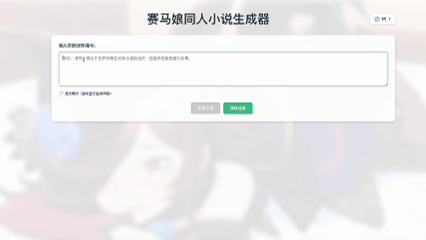

# 目的

要让LLM能够创作符合人设的赛马娘怪文书的同人文，有以下几种思路：

- 使用足够多的怪文书语料微调开源大模型
- 使用RAG的方式给LLM提供相关角色的人设，或者是优秀的范例
- 使用function call 的方法在LLM创作前先爬取相关的网页，包括角色设定、优秀的怪文书样例等

下面是使用 RAG+Web Crawler 的方法进行怪文书写作的示例。

## Demo



## ENV

### OS

在Ubuntu、MacOS、WSL(Ubuntu)中进行过测试。在Windows上无法运行，因为crawl4ai所需的Playwright会出现问题。

### Proxy

使用http代理，因为赛马娘的萌娘百科通常需要使用代理才能访问。如果没有配置代理，将使用无代理的爬虫。

### Python 环境

使用[anaconda](https://www.anaconda.com/products/individual)或者[uv](https://github.com/astral-sh/uv)

conda

        conda create -n umamusume-novel python=3.12
        conda activate umamusume-novel
        pip install -r requirements.txt

uv

        uv venv --python 3.12
        source .venv/bin/activate
        uv sync

安装crawl4ai所需的浏览器

        playwright install

## .env

        cat .env.template > .env

将.env.template复制为.env，修改其中的API_KEY。

我测试时使用的LLM为QWEN，和OPENAI的格式是兼容的。如果要使用OPENAI，直接修改INFO_LLM_MODEL_NAME等即可，不用管前缀和下面的OPENAI_API_KEY。

QWEN的API在[官网](https://bailian.console.aliyun.com/?tab=model#/model-market)中获取，免费也是有不少额度的。

INFO_LLM_MODEL_NAME 可以使用一些Tool Call能力强的模型；

WRITER_LLM_MODEL_NAME 可以使用一些更擅长创作的模型。


## 运行

### 赛马娘怪文书写作

阶段1:
使用RAG MCP先查询本地向量数据库的赛马娘的角色信息,获得相对准确的信息,
阶段2:
使用WEB MCP在网络上查询赛马娘的角色信息,
阶段3:
根据这些信息去创作小说。

其中阶段1和阶段2使用INFO_LLM_MODEL_NAME来调用工具获取信息，而阶段3创作小说不需要调用工具，使用WRITER_LLM_MODEL_NAME这种更擅长生成的模型。

运行`source .venv/bin/activate`开启环境

方法一：

在终端1中运行`bash ./scripts/run-server.sh`开启服务器

等待Web MCP 和 RAG MCP 启动成功，RAG使用本地的向量数据库，因此会比较慢。

在终端2中运行`bash ./scripts/run-client.sh`开启客户端

通过修改`./scripts/run-param.sh`中的端口来修改配置。

方法二：命令行客户端

```bash
# 方式 1：启动服务器并直接进入流式客户端（推荐）
python main.py with-client

# 方式 2：启动服务器并进入非流式客户端
python main.py with-client --no-stream

# 方式 3：仅启动服务器（后台运行）
python main.py server-only
# 然后在另一个终端使用客户端
python -m src.umamusume_novel.client.cli --stream
```

**客户端模式说明：**
- **流式模式（默认）**：实时显示生成过程，包括 RAG 搜索、Web 搜索、生成内容
- **非流式模式**：等待完整结果后一次性显示

方法三：前端展示

终端1中运行`python main.py server-only`，开启服务。

终端2中运行`cd frontend`进入 frontend ,运行`pnpm run dev`启动前端开发服务器

启动成功后，终端会显示本地访问地址，通常是 `http://localhost:5173/`。在浏览器中打开这个地址即可访问前端界面。

在log文件中查看工具调用和服务器的输出。

在frontend/public 下添加background.jpg可设置背景。

## 结果

[Result](./resources/results/result.md)工具调用的结果等

[Novel](./resources/results/gen_novel.md)生成的一些同人小说

## 相关工具

### ‌RAG（Retrieval Augmented Generation）

RAG‌是一种通过检索外部知识库来增强大语言模型 （LLM）生成能力的技术。RAG通过结合检索和生成两个阶段，使得模型能够根据用户的查询从知识库中检索相关信息，并据此生成更准确和相关的回答。
RAG的基本流程包括三个主要步骤：索引、检索和生成。在索引阶段，数据源被读取并分割成文档，然后通过向量存储嵌入。在检索阶段，模型根据用户的查询从知识库中检索相关文档。最后，在生成阶段，模型基于检索到的文档生成回答‌。

### Web Crawler

使用 `umamusume-web-crawler` 库。该库封装了针对 **Bilibili Wiki (wiki.biligame.com)** 和 **萌娘百科 (mzh.moegirl.org.cn)** 的专用爬虫工具，支持通过 MediaWiki API 高效获取结构化文本，避免了传统的 HTML 解析问题。同时也保留了基于 Crawl4AI 的通用网页爬取能力。

### Web Search

Google:需要设置适当的 API 密钥和环境变量。要进行设置，请在 Google Cloud 凭证控制台 （https://console.cloud.google.com/apis/credentials） 中创建GOOGLE_API_KEY，并使用可编程搜索引擎 （https://programmablesearchengine.google.com/controlpanel/create） 创建GOOGLE_CSE_ID。
Custom Search JSON API 每天免费提供 100 次搜索查询。额外请求的费用为每 1000 次查询 $5，每天最多 1 万次查询。

[监控](https://console.cloud.google.com/apis/dashboard?hl=zh-cn)

## 服务配置

## 默认端口配置

使用以下默认端口：

| 服务 | 端口 | 说明 |
|------|------|------|
| **主服务器** | `1111` | 小说生成主服务，提供 `/ask` 和 `/askstream` 接口 |
| **RAG MCP** | `7777` | RAG 知识库检索服务 |
| **Web MCP** | `7778` | Web 搜索服务 |
| **前端开发服务器** | `5173` | Vue 前端开发服务器（开发模式） |

## 项目结构

        umamusume-novel/
        |-.env                        # 配置文件，需要自己配置key（如API密钥等）
        |-.env.template               # 环境变量模板，供参考和新环境设置
        |-LICENSE                     # 项目许可证文件
        |-
        |-logs/                       # 日志文件存放目录
        |   |-rag_mcp.log             # RAG MCP服务日志
        |   |-web_mcp.log             # Web MCP服务日志
        |   |-server.log              # Server服务日志
        |-
        |-resources/                  # 资源文件存放目录
        |   |-docs/                   # RAG所需文档
        |   |-results/                # 工具运行结果，生成的一些小说样本
        |-
        |-scripts/                    # 包含所有Shell脚本的目录
        |   |-run-client.sh           # 运行客户端脚本，用于启动客户端
        |   |-run-param.sh            # 参数配置文件，定义了服务器端口等参数
        |   |-run-server.sh           # 启动服务器脚本，负责启动MCP Server及小说生成服务
        |   |-stop-server.sh          # 停止服务器脚本，用于终止运行中的服务
        |-
        |-src/                        # 源代码根目录
        |   |-umamusume_novel/        # 主项目包
        |       |-client/             # 客户端模块
        |       |   |-__init__.py
        |       |   |-umamusume_client.py  # 客户端实现文件
        |       |   |-cli.py               # 命令行调用
        |       |
        |       |-prompt/             # Agent的提示词库
        |       |   |-searchinweb.md
        |       |   |-writenovel.md
        |       |   |-...
        |       |
        |       |-rag/                # RAG相关模块
        |       |   |-__init__.py
        |       |   |-rag.py          # RAG核心逻辑实现
        |       |   |-raginfomcp.py   # RAG MCP服务实现
        |       |
        |       |-server/             # 服务端模块
        |       |   |-__init__.py     # 初始化文件
        |       |   |-novel_generator.py  # 小说生成逻辑实现
        |       |   |-rag_query.py    # RAG查询逻辑实现
        |       |   |-umamusume_create_novel.py  # 服务端主程序入口
        |       |
        |       |-web/                # Web相关模块
        |           |-__init__.py     # 初始化文件
        |           |-webinfomcp.py   # Web MCP服务实现 (使用 umamusume-web-crawler 库)
        |-frontend/
        |   |- ... (前端代码)
        |-
        |-tests/                      # 测试脚本
        |   |-test_search.py          # 测试搜索功能
        |   |-test_crawler.py         # 测试爬虫功能
        |   |-...
        |-
        |-pyproject.toml              # 项目配置文件
        |-uv.lock
        |-requirements.txt            # 项目依赖项文件，列出所有必需的Python包
        |-README.md                   # 项目说明文档，包括安装、运行指南等


## NOTICE
Disclaimer for Generated Content:

The software may generate content, output, or data as a result of its operation. The copyright holder provides no warranty, express or implied, regarding the accuracy, reliability, or suitability of such generated content. The use of the software and any content it generates is entirely at your own risk. The copyright holder shall not be liable for any damages, losses, or consequences arising from the use or misuse of the generated content.

关于生成内容的免责声明：

本软件在运行过程中可能生成内容、输出或数据。版权持有者对这些生成内容的准确性、可靠性或适用性不提供任何形式的担保。使用本软件及其生成内容的风险完全由使用者自行承担。版权持有者不对因使用或误用生成内容而造成的任何损害、损失或后果承担责任。

